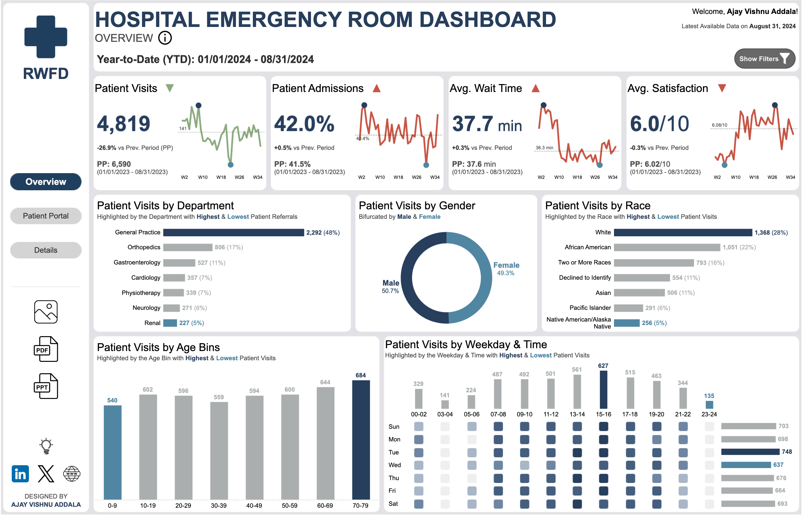

# **ER Admissions Dashboard**

## **Project Overview**
The **ER Admissions Dashboard** is a comprehensive, interactive Tableau dashboard designed to analyze and visualize Emergency Room admissions data. The project focuses on creating a user-centric, visually engaging dashboard while demonstrating advanced Tableau capabilities and best practices for data visualization.

## **Key Features**
1. **Time Selection Parameter**
   - Allows users to switch between different time views:
     - **Year-to-Date (YTD)**: Insights from the beginning of the current year to the latest date.
     - **Trailing 12 Months (T12M)**: Data covering the past 12 months.
     - **Last Full Month (LFM)**: Analysis of the most recent completed month.
   - Empowers users to explore data dynamically based on their specific needs.

2. **Dynamic Zone Visibility**
   - Implemented dynamic visibility to control which elements are displayed based on user interactions.
   - Improves dashboard usability by ensuring only relevant components are visible at any given time.

3. **Level of Detail (LOD) Expressions**
   - Utilized LOD expressions for advanced calculations, such as department-level average wait time compared to the overall average.
   - Enhanced analytical depth and provided actionable insights for operational efficiency.

4. **Current vs. Prior Period Comparison**
   - Included a calculation to compare current-period metrics to the prior period.
   - Highlighted trends and variances for informed decision-making.

5. **Dashboard Design and Best Practices**
   - **Readability**: Clear titles, labels, and informative tooltips.
   - **Consistency**: Aligned elements, harmonious color schemes, and professional fonts.
   - **User Experience**: Intuitive layout with responsive navigation.

---

## **Snapshot**
Below is a preview of the dashboard:  
  
*(Replace "link-to-snapshot-image" with the actual URL or path to the image.)*

---

## **Interactive Dashboard**
Explore the interactive dashboard on Tableau Public:  
[**ER Admissions Dashboard on Tableau Public**](https://public.tableau.com/views/HospitalERDashboardRWFD_17391577222710/Overview?:language=en-US&publish=yes&:sid=&:redirect=auth&:display_count=n&:origin=viz_share_link)

*(Replace "your-profile-name" and "er-admissions-dashboard" with the actual profile and dashboard names.)*

---

## **Workflow**

### **1. Data Exploration**
   - Reviewed the dataset to understand its structure, key parameters, and relationships.
   - Explored the data dictionary to identify primary keys and other important fields.

### **2. Ideation and Design**
   - Sketched an initial design on paper to visualize the layout and key elements.
   - Created a quick prototype in Canva to finalize the dashboard's overall structure and functionality.
   - Developed detailed wireframes in Figma with precise dimensions and custom icons.

### **3. Implementation**
   - Built the dashboard in Tableau using the defined wireframe as a guide.
   - Selected a color palette from **Color Hunt** to ensure a professional, visually appealing design.
   - Iteratively refined the visualizations, optimizing for readability and impact.

### **4. Testing and Refinement**
   - Tested the dashboard for performance and usability.
   - Incorporated feedback from sample users to enhance its functionality and aesthetics.

---

## **Tools and Technologies**
- **Tableau**: Dashboard development and visualization.
- **Figma**: Wireframing and custom icon creation.
- **Canva**: Rapid prototyping.
- **Color Hunt**: Color palette selection.

---

## **Use Cases**
1. **Operational Analysis**: Analyze ER admissions trends and identify peak periods.
2. **Performance Metrics**: Evaluate average wait times and departmental performance.
3. **Data-Driven Decisions**: Enable stakeholders to make informed decisions based on real-time insights.

---

## **Future Improvements**
- **Scalability**: Adapt the dashboard to accommodate additional datasets and metrics.
- **Advanced Analytics**: Incorporate predictive modeling for trend forecasting.
- **User Feedback Integration**: Continue refining the dashboard based on stakeholder input.

---

## **Getting Started**
1. Clone the repository:
   ```bash
   git clone https://github.com/your-username/er-admissions-dashboard.git
